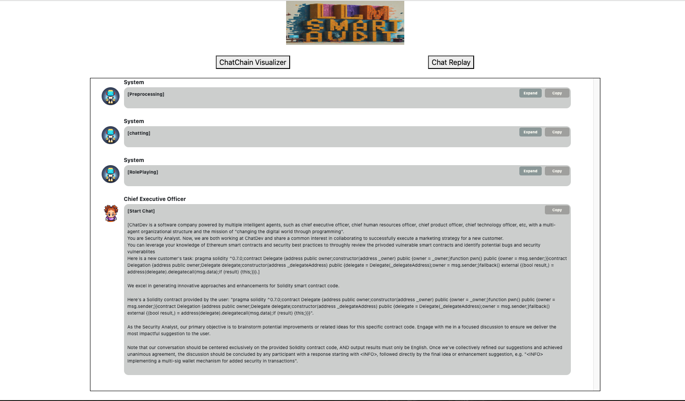
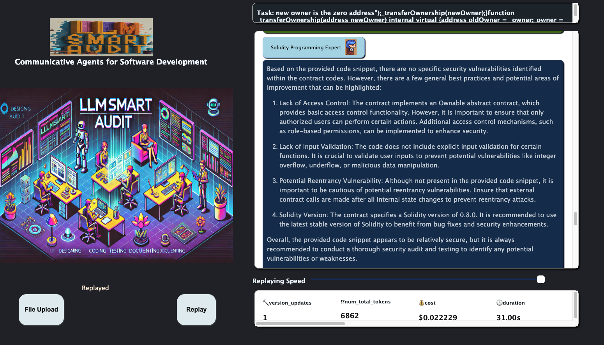

# LLMSmartAuditTool
The tool of LLMSmartAudit


## 1. Install Env
pip install -r requirements.txt

## 2. set your openai key
export OPENAI_API_KEY="sky-{}"

## 3. How to use tool
Input your solidity smart contract code into `task`

###  Run BA mode
```python
python3 run.py --org "" --config "SmartContractBA" --task "" --name ""
```

### Run TA mode
```python
python3 run.py --org "" --config "SmartContractTA" --task "" --name ""
```

### Show Results
```python
python3 online_log/app.py
```
open local web http://127.0.0.1:8000/

## 4. Display 
### Chatchain


### Chatchain


### Muti-conversions between LLM-based Agents



